# Machine Learning

机器学习笔记，[B站吴恩达老师视频](https://www.bilibili.com/video/BV164411S78V/?spm_id_from=333.999.0.0)

https://github.com/BroMiaoY/Note/blob/main/MachineLearning/MachineLearning/

## 1 Supervised Learning AND Unsupervised Learning

### 1.3 Supervised Learning

“right answer”given 有标签

- **Pegression Problem** :Predict continuous valued Output(Price)

.png)

- **Classificaton Problem**:Discrete valued Output(0 or 1)

  - one feature

  .png)

  - two feature

.png)

### 1.4 Unsupervised Learning

clustering algorithms

### 1.5 Summarize

- **Supervised Learning**：有标签
  - Regression Problem：Predict continuous value
    - 房价预测、股票预测
  - Classification Problem：Predict discrete value
    - 垃圾邮件检测
- **Unsupervised Learning**：无标签
  - Clustering
    - ​	推荐系统

## 2 Linear regression with one variable

### 2.1 模型描述

- **Notation**
  - m:训练集大小
  - X：输入变量/特征
  - y：输出变量

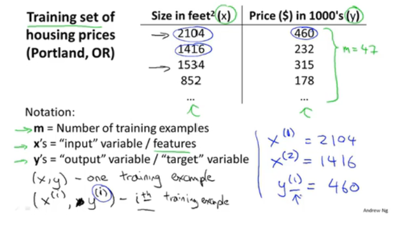

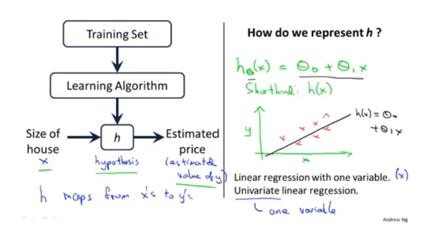

### 2.2 Cost Function

- **Cost Function/平方误差代价函数**：

计算使得**训练集中\*预测值-实际值\*的平方总和的平均值**最小的两个参数

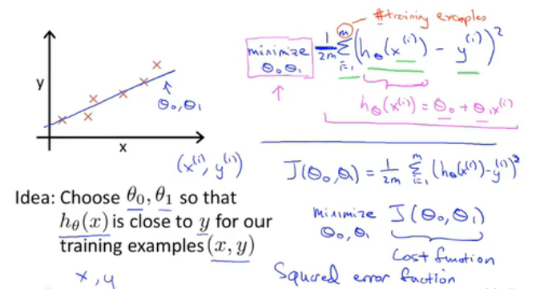

### 2.3 Cost Function(1)

- **简化**

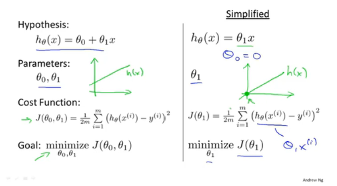

- 回归函数和代价函数

  - $θ_1 = 1$

  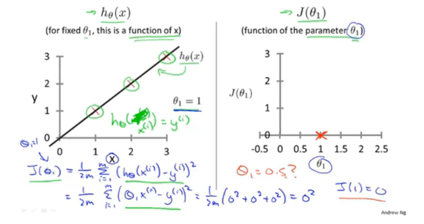

  - $θ_1 = 0.5$

  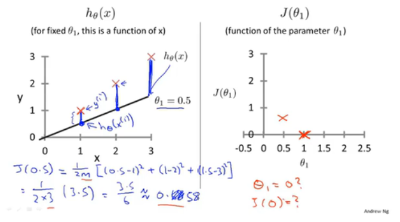

  

- Cost Function/$(θ_0 = 0)$时**J(θ1)图**

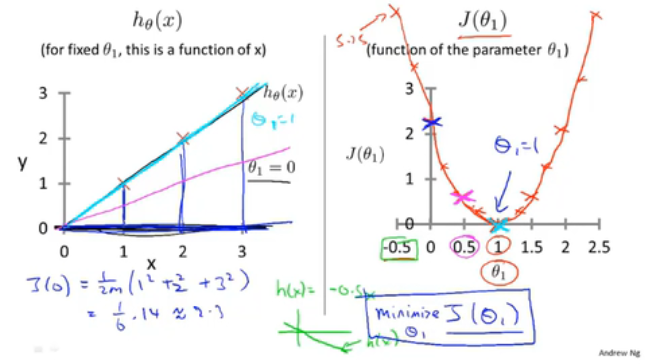

### 2.4 Cost Function(2)

- **线性回归的代价函数图示**

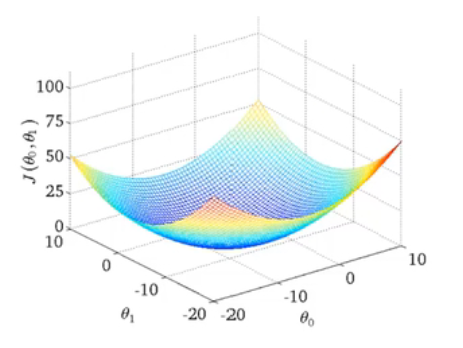

- **Cost Function等高线图**

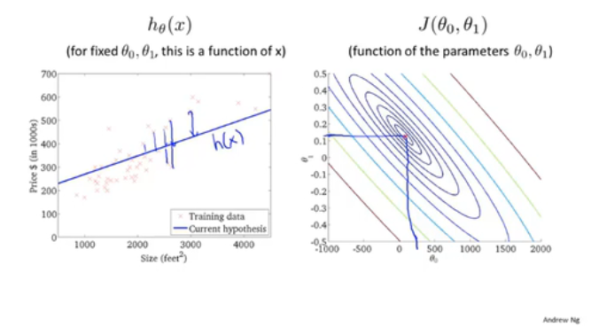

### 2.5 Gradient descent

keep changing  $θ_0,θ_1$ to reduce $J(θ_0,θ_1)$

- **Gradient descent algorithm**:
  - `:=` Assignment/赋值
  - `α` :learning rate/步长
- 同步更新：Simultaneous update

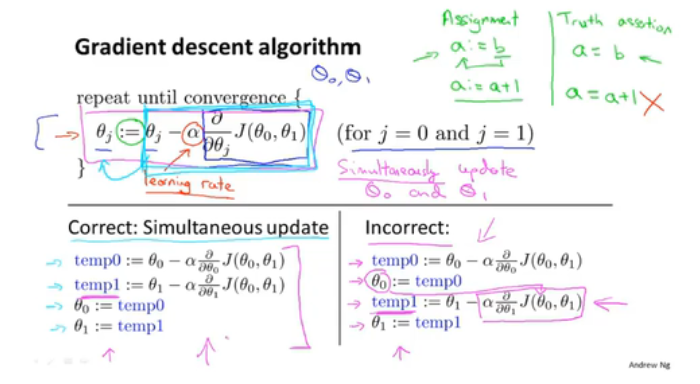

### 2.6 Summarize Gradient descent

- **步长太小**：梯度下降慢
- **步长太大**：可能越过最优解

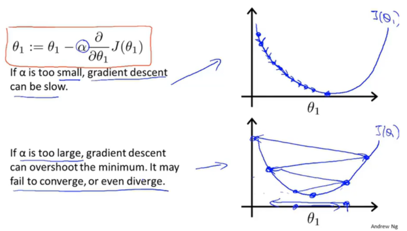

- **达到局部最优解时**：参数不再变化，停止下降

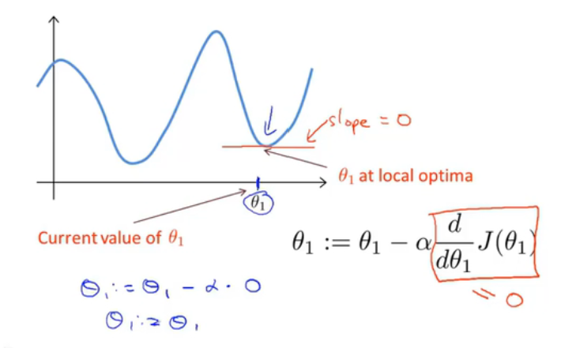

- **越接近最优解，下降速度越慢**：无需修改步长，倒数会越来越小

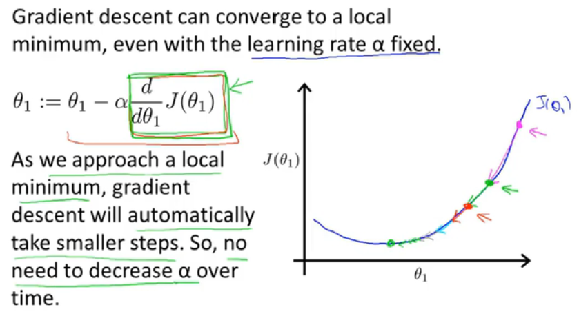

### 2.7 Gradient descent for linear regression

- 利用梯度下降法最小化平方差代价函数：最重要的是编导项的确定

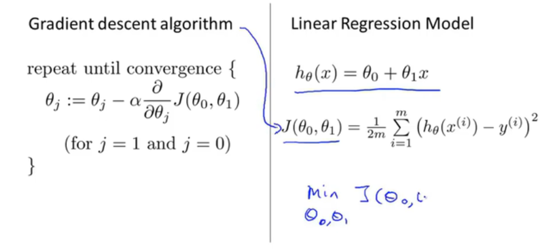

- 带入、求导

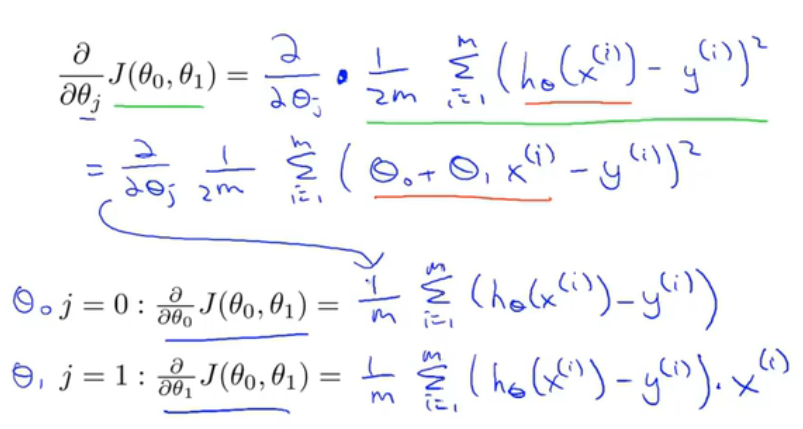

- 代入Gradient descent algorithm

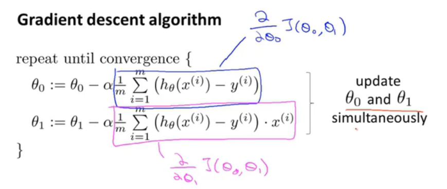

## 3 Linear Algebra review

### 3.1 Matrices and vectors

vectors is $n \times 1$ matirx

### 3.2 Addition  and scalar multiplication

矩阵的加减法

### 3.3 Matrix-vector multiplication

矩阵向量相乘

**将实际问题转化为：矩阵向量相乘**

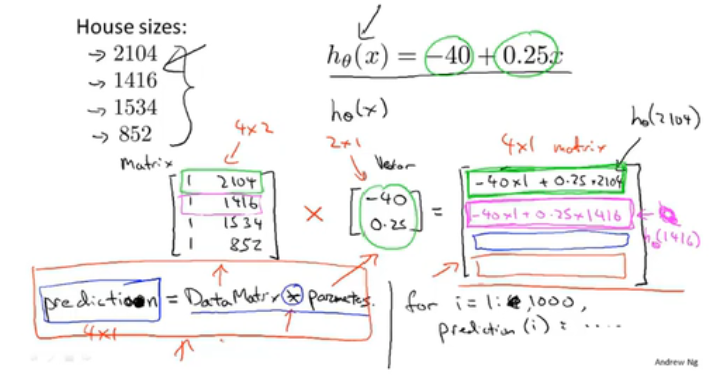

### 3.4 Matrix-matrix multiplication

$n \times m \ast m \times o \rightarrow n \times o$

**实际问题转化成：矩阵与矩阵相乘/多个假设回归函数**

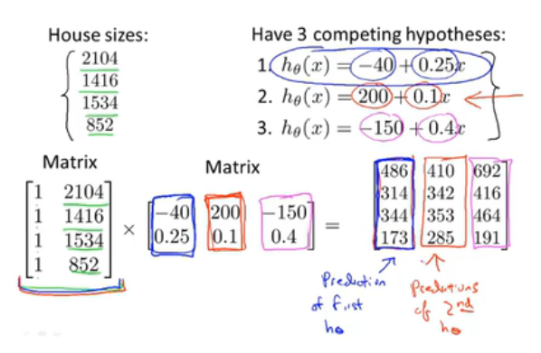

### 3.5 Matrix mutiplication properties矩阵乘法特征

- 矩阵乘法**没有**交换律：$A×B ≠ B×A$

- 矩阵乘法**有**结合律：$A×(B×C) = (A×B)×C$

- **Identity Matrix**单位矩阵：
  - 对角线为1，其余为0
  - For any matrix：$A·I = I·A = A$

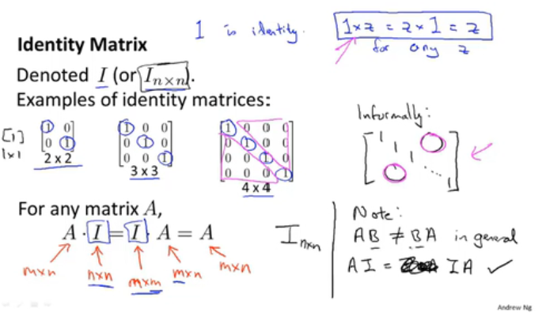

### 3.6 Inverse and transpose逆和转置

- **A×A的逆矩阵 = A的逆矩阵×A = I**

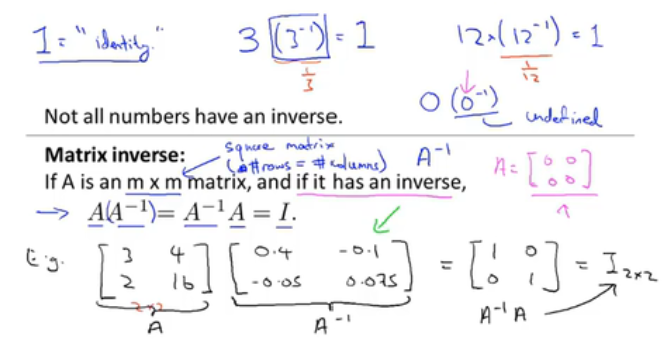

- **Matrix Transpose**矩阵的转置

## 4 Linear Regression with multiple variables

### 4.1 Multiple features(variables)

- **Notation**:
  - n：特征的数量
  - x^(i)^：第i行，既第i个特征向量
  - x^(i)^~j~：第i个特征向量的第j个特征值

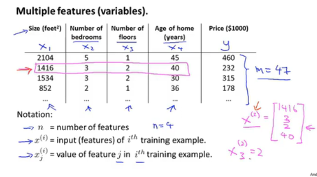

- Multivariate linear regression transfer to Matrix Multiplication：多元线性回归问题转化为矩阵相乘

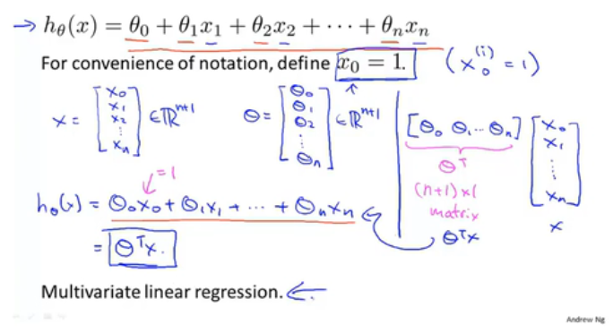

### 4.2 Gradient descent for multiple variables

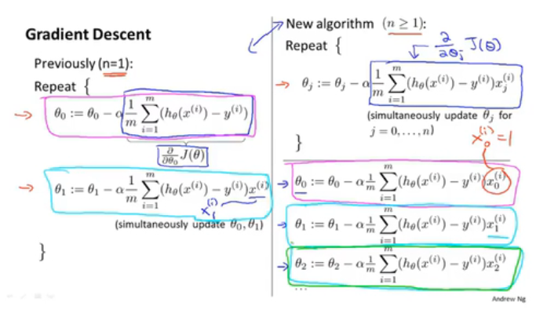

### 4.3 Gradient descent in practice I:Feature Scaling特征缩放

- 比例缩放：**特征之间取值范围差异过大**会出现代价函数的等高线图偏移严重（太瘦或太胖）
- 比例缩放后：在进行梯度下降时下降的路径就不会左右摇摆，因此能够更快的收敛

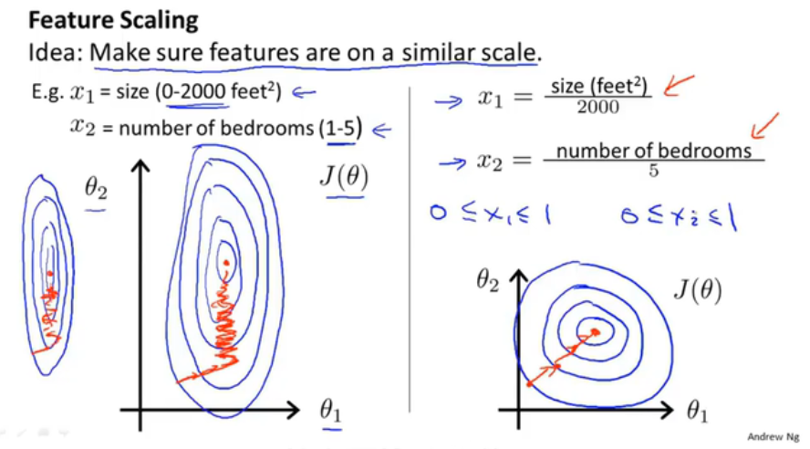

- 缩放习惯

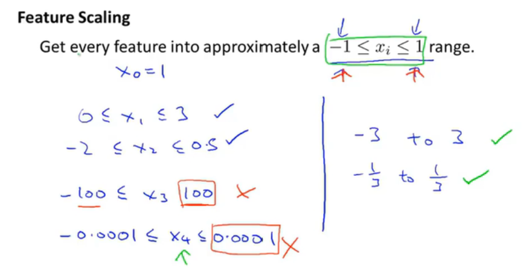

- **mean normalization**均值归一化
  - $\mu$：平均值
  - $s_1$：总数

$$
x_1 = \frac{x_1 - \mu}{s_1}
$$

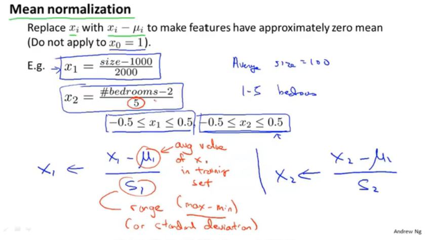

### 4.4 Gradient descent in  practice Ⅱ: Learning rate $\alpha$

- **Making sure gradient descent is working correctly**

​		$J(\theta)$ should decrease after every iterations(迭代)

- 判断是否收敛，<$\varepsilon$的值

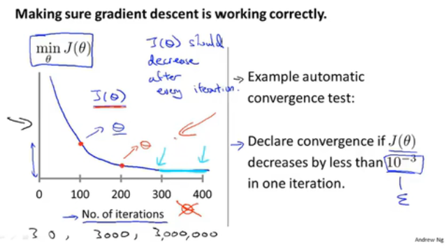

- **learning rate**太大可能冲过最小值，就会出现Gradient descent出错

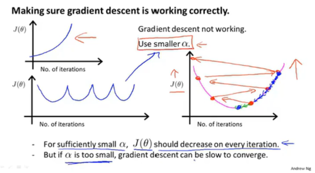

- **Summary**
  - $\alpha$ 太小可能出现收敛较慢
  - $\alpha$ 太大可能$J(\theta)$在每次迭代时没有收敛

### 4.5 Features and polynomial regression多项式回归

根据不同情况做合适的特征选择

### 4.6 Normal equation（正态方程）

直接找到最优解的$\theta$使得的Cost function：$J(\theta)$最小

求偏导置0，解出参数的取值
$$
\theta = (X^TX)^{-1}X^Ty
$$
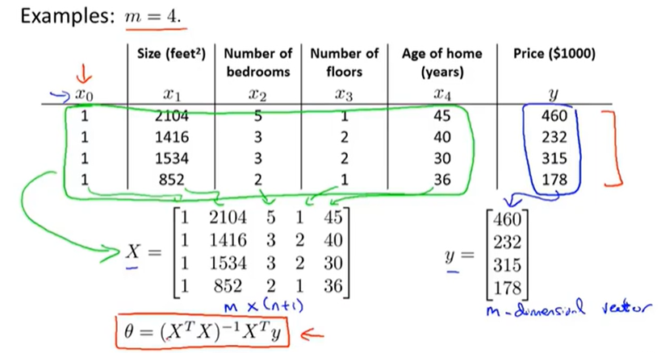

-  构建矩阵$X$

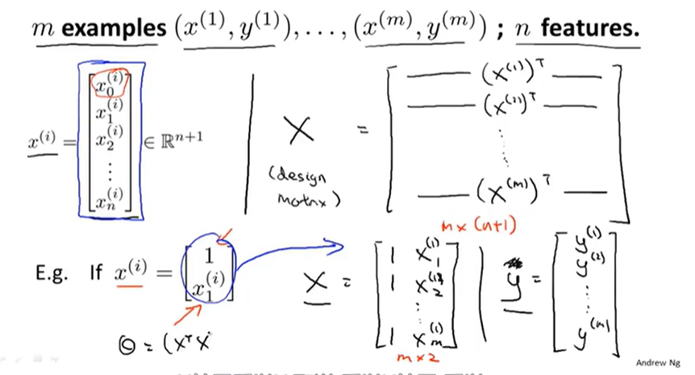

- gradient descent 和 normal equation 优缺点对比

|      Gradient Descent       |                      Normal Equation                      |
| :-------------------------: | :-------------------------------------------------------: |
|   需要选择合适的$\alpha$    |                  无需选择合适的$\alpha$                   |
|        需要多次迭代         |                       无需多次迭代                        |
| 当$n$很大的时候依然可以工作 | 需要计算$(X^TX)^{-1}$ 因此当$n$较大时矩阵那个运算较慢 |

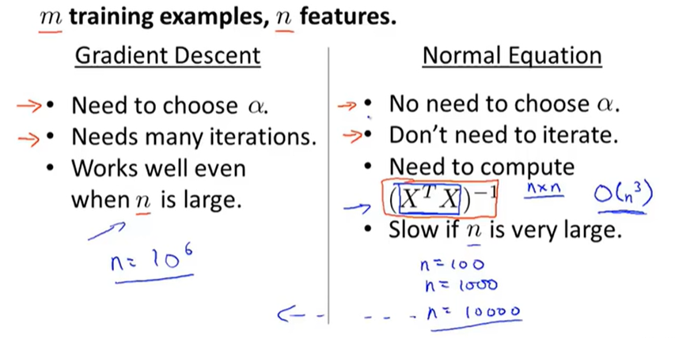

### 4.7 Normal equation and non-invertibility(不可逆性)

- **$X^TX$不可逆**
  - 存在**Redandunt features**冗余特征时：行（列）向量线性相关时**Linearly dependent**（线性依赖）
    - 删除冗余的特征
  - Too many features ($m \le n$)特征数量大于训练集
    - 删除一些特征，或正则化

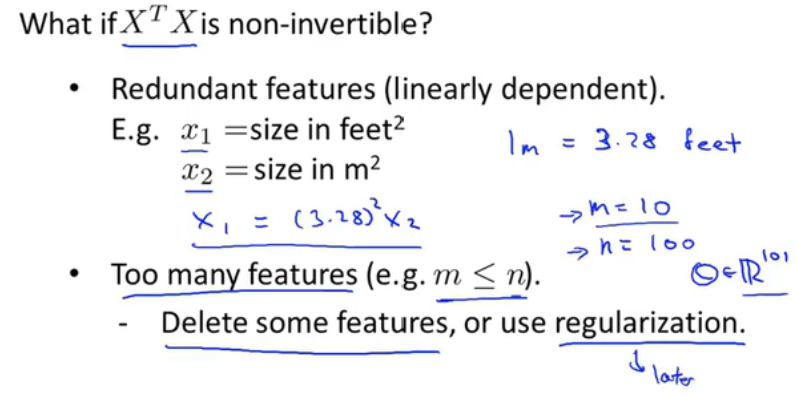

**相当于方程的数量小于未知数的数量，因此无解**

##  6 Logistic Regression

### 6.1 Classification

- 线性回归不适用于分类的问题的原因：噪声影响回归模型

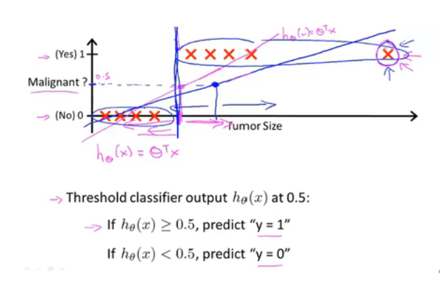

- 使用**Logistic Regression**代替**Linear Regression**处理**Classification**

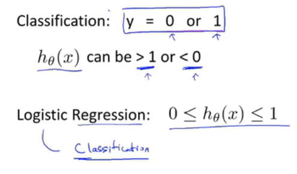

###  6.2 Hypothesis Representation假设表示

- **Logistic Regression Modle**：Sigmoid function/Logistic function

$$
g(z) = \frac{1}{1 + e^{-z}}
$$

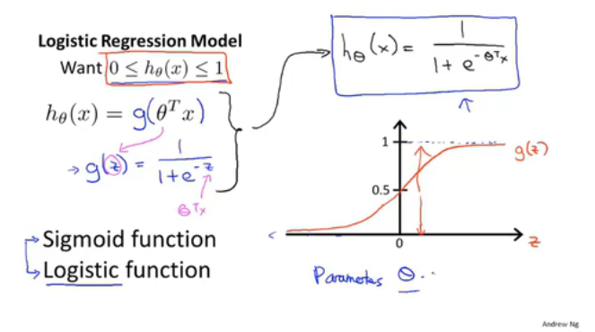

### 6.3 Decision boundary决策界限

- **e.g: Logistic regression**
  - $g(z)\geq 0.5$    $when$   $z \geq 0$
  - $h_\theta (x) = g(\theta^T x) \geq 0.5$  $when$  $\theta^T x \geq 0$

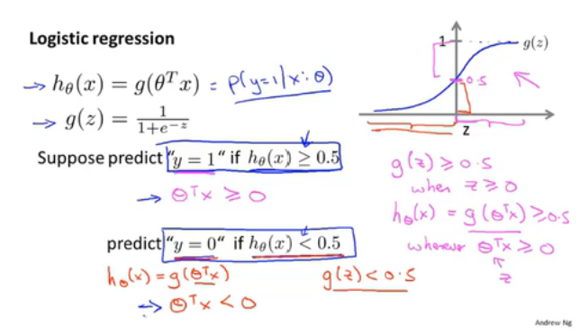

- **Decision Boundary**:决策边界

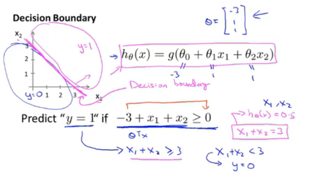

- **non-linear decision boundaries:**非线性决策边界

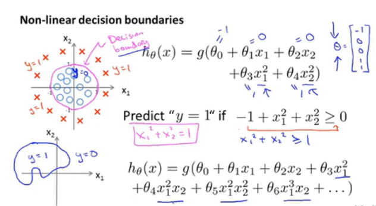

### 6.4 Cost function

-  **线性回归存在的问题**：可能代价函数不是一个凸
  - 可能存在多个局部最优解
  - 因此在梯度下降时存在未收敛到全局最小值的情况

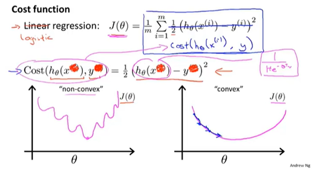

- 使用**Logistic regression**实现代价函数呈现凸图
  - 关注$z \in [0, 1]$因此图像为下图

- 公式含义：也就是公式$-\log{z} \in (0,1]$,  if  $ y=1$的函数意义
  - 当预测值和实际值都1时cost function=0
  - 当预测值和实际值一个为0，另一个为1时，cost function=$\infty$
  - 也就是当错误越大，那么惩罚也越大
- **Logistic regression cost function when** **y=1**

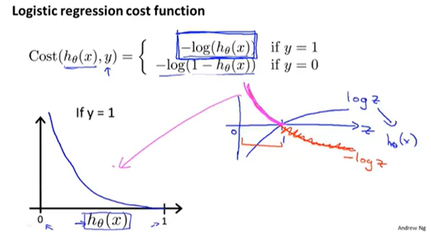

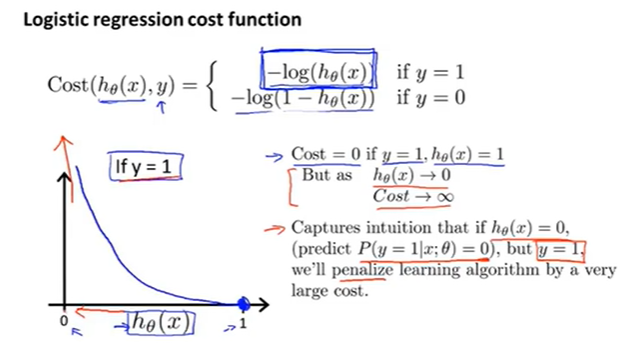

- **Logistic regression cost function when** **y=0**

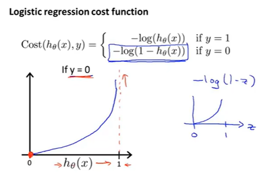

### 6.5 Simplified cost function and gradient descent

- **单个训练样本的Cost function**

$$
Cost(h_\theta (x), y) = -y\log{(h_\theta (x))} - (1-y)\log{(1-h_\theta (x))}
$$

- **解释：**
  - IF $y=1:$  $Cost(h_\theta (x), y) = -\log{h_\theta (x)}$
  - IF $y=0:$  $Cost(H_\theta (x), y) = -\log{(1-h_\theta (x))}$  

 

- **Logistic regression cost function**
  - 概率论：**极大似然法**得来

$$
\begin{aligned}
J(\theta) &= \frac{1}{m}\sum^m_{i-1}{Cost(h_\theta(x^{(i)}), y^{(i)})}\\
		  &=  -\frac{1}{m}[\sum^m_{i-1}{y^{(i)}\log{h_\theta(x^{(i)}) + (1-y^{(i)})\log{(1-h_\theta(x^{(i)}))}}}]
\end{aligned}
$$

- 为了使得cost function最小，拟合出合适的$\theta$

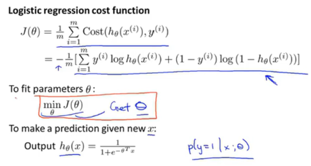

- **Gradient Descent**

$$
J(\theta) = -\frac{1}{m}[\sum^m_{i-1}{y^{(i)}\log{h_\theta(x^{(i)}) + (1-y^{(i)})\log{(1-h_\theta(x^{(i)}))}}}]
$$

使得$J(\theta)$最小：

Repeat {

​				$\begin{aligned}\theta_j &:= \theta_j - \alpha\frac{\partial}{\partial \theta_j}{J(\theta)}\\ &:=\theta_j - \alpha\sum^m_{i-1}(h_\theta(x^{(i)} - y^{(i)})x_j^{(i)}) \end{aligned}$ 

}

- 刚好和线性回归的求导结果一样，但实际的意义不同，逻辑回归使用了sigomid映射函数
