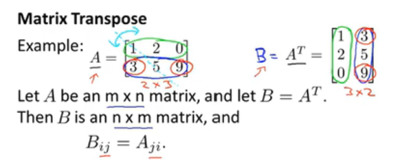

# Machine Learning

机器学习笔记，[B站吴恩达老师视频](https://www.bilibili.com/video/BV164411S78V/?spm_id_from=333.999.0.0)

https://github.com/BroMiaoY/Note/blob/main/MachineLearning/MachineLearning/

## 1 Supervised Learning AND Unsupervised Learning

### 1.3 Supervised Learning

“right answer”given 有标签

- **Pegression Problem** :Predict continuous valued Output(Price)

.png)

- **Classificaton Problem**:Discrete valued Output(0 or 1)

  - one feature

  .png)

  - two feature

.png)

### 1.4 Unsupervised Learning

clustering algorithms

### 1.5 Summarize

- **Supervised Learning**：有标签
  - Regression Problem：Predict continuous value
    - 房价预测、股票预测
  - Classification Problem：Predict discrete value
    - 垃圾邮件检测
- **Unsupervised Learning**：无标签
  - Clustering
    - ​	推荐系统

## 2 Linear regression with one variable

### 2.1 模型描述

- **Notation**
  - m:训练集大小
  - X：输入变量/特征
  - y：输出变量

### 2.2 Cost Function

- **Cost Function/平方误差代价函数**：

计算使得**训练集中\*预测值-实际值\*的平方总和的平均值**最小的两个参数

### 2.3 Cost Function(1)

- **简化**

- 回归函数和代价函数

  - $θ_1 = 1$

  

  - $θ_1 = 0.5$

  

  

- Cost Function/$(θ_0 = 0)$时**J(θ1)图**

### 2.4 Cost Function(2)

- **线性回归的代价函数图示**

- **Cost Function等高线图**

### 2.5 Gradient descent

keep changing  $θ_0,θ_1$ to reduce $J(θ_0,θ_1)$

- **Gradient descent algorithm**:
  - `:=` Assignment/赋值
  - `α` :learning rate/步长
- 同步更新：Simultaneous update

### 2.6 Summarize Gradient descent

- **步长太小**：梯度下降慢
- **步长太大**：可能越过最优解

- **达到局部最优解时**：参数不再变化，停止下降

- **越接近最优解，下降速度越慢**：无需修改步长，倒数会越来越小

### 2.7 Gradient descent for linear regression

- 利用梯度下降法最小化平方差代价函数：最重要的是编导项的确定

- 带入、求导

- 代入Gradient descent algorithm

## 3 Linear Algebra review

### 3.1 Matrices and vectors

vectors is $n \times 1$ matirx

### 3.2 Addition  and scalar multiplication

矩阵的加减法

### 3.3 Matrix-vector multiplication

矩阵向量相乘

**将实际问题转化为：矩阵向量相乘**

### 3.4 Matrix-matrix multiplication

$n \times m \ast m \times o \rightarrow n \times o$

**实际问题转化成：矩阵与矩阵相乘/多个假设回归函数**

### 3.5 Matrix mutiplication properties矩阵乘法特征

- 矩阵乘法**没有**交换律：$A×B ≠ B×A$

- 矩阵乘法**有**结合律：$A×(B×C) = (A×B)×C$

- **Identity Matrix**单位矩阵：
  - 对角线为1，其余为0
  - For any matrix：$A·I = I·A = A$

### 3.6 Inverse and transpose逆和转置

- **A×A的逆矩阵 = A的逆矩阵×A = I**

- **Matrix Transpose**矩阵的转置

## 4 Linear Regression with multiple variables

### 4.1 Multiple features(variables)

- **Notation**:
  - n：特征的数量
  - x^(i)^：第i行，既第i个特征向量
  - x^(i)^~j~：第i个特征向量的第j个特征值

- Multivariate linear regression transfer to Matrix Multiplication：多元线性回归问题转化为矩阵相乘

### 4.2 Gradient descent for multiple variables

### 4.3 Gradient descent in practice I:Feature Scaling特征缩放

- 比例缩放：**特征之间取值范围差异过大**会出现代价函数的等高线图偏移严重（太瘦或太胖）
- 比例缩放后：在进行梯度下降时下降的路径就不会左右摇摆，因此能够更快的收敛

- 缩放习惯

- **mean normalization**均值归一化
  - $\mu$：平均值
  - $s_1$：总数

$$
x_1 = \frac{x_1 - \mu}{s_1}
$$

### 4.4 Gradient descent in  practice Ⅱ: Learning rate $\alpha$

- **Making sure gradient descent is working correctly**

​		$J(\theta)$ should decrease after every iterations(迭代)

- 判断是否收敛，<$\varepsilon$的值

- **learning rate**太大可能冲过最小值，就会出现Gradient descent出错

- **Summary**
  - $\alpha$ 太小可能出现收敛较慢
  - $\alpha$ 太大可能$J(\theta)$在每次迭代时没有收敛

### 4.5 Features and polynomial regression多项式回归

根据不同情况做合适的特征选择

### 4.6 Normal equation（正态方程）

直接找到最优解的$\theta$使得的Cost function：$J(\theta)$最小

求偏导置0，解出参数的取值
$$
\theta = (X^TX)^{-1}X^Ty
$$

-  构建矩阵$X$

- gradient descent 和 normal equation 优缺点对比

|      Gradient Descent       |                      Normal Equation                      |
| :-------------------------: | :-------------------------------------------------------: |
|   需要选择合适的$\alpha$    |                  无需选择合适的$\alpha$                   |
|        需要多次迭代         |                       无需多次迭代                        |
| 当$n$很大的时候依然可以工作 | 需要计算$(X^TX)^{-1}$ 因此当$n$较大时矩阵那个运算较慢 |

### 4.7 Normal equation and non-invertibility(不可逆性)

- $X^TX$不可逆问题

