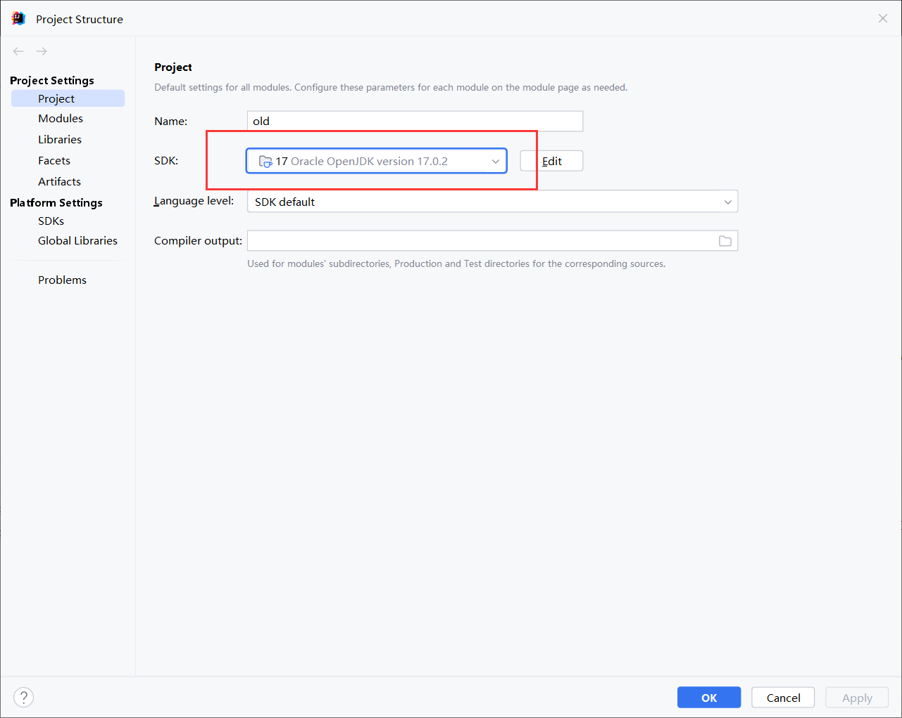

# SpringBoot

### 常见问题

#### 1 报错“未结束的字符文字”；“非法字符: '\ufffd'”

##### 原因：idea中的Global Encoding和Project Encodeing不统一

`.idea`文件下的`encoding.xml`文件如下

```xml
<?xml version="1.0" encoding="UTF-8"?>
<project version="4">
  <component name="Encoding">
    <file url="file://$PROJECT_DIR$/src/main/java" charset="UTF-8" />
    <file url="file://$PROJECT_DIR$/src/main/java/com/oralcalculation/util/generate/Context/FormulaContext.java" charset="GBK" />
    <file url="file://$PROJECT_DIR$/src/main/java/com/oralcalculation/util/generate/Enum/Operator.java" charset="GBK" />
    <file url="file://$PROJECT_DIR$/src/main/java/com/oralcalculation/util/generate/Enum/StrategyType.java" charset="GBK" />
    <file url="file://$PROJECT_DIR$/src/main/java/com/oralcalculation/util/generate/Factory/FormulaFactory.java" charset="GBK" />
    <file url="file://$PROJECT_DIR$/src/main/java/com/oralcalculation/util/generate/Formula/AddFormula.java" charset="GBK" />
    <file url="file://$PROJECT_DIR$/src/main/java/com/oralcalculation/util/generate/Formula/DivFormula.java" charset="GBK" />
    <file url="file://$PROJECT_DIR$/src/main/java/com/oralcalculation/util/generate/Formula/Formula.java" charset="GBK" />
    <file url="file://$PROJECT_DIR$/src/main/java/com/oralcalculation/util/generate/Formula/MultiFormula.java" charset="GBK" />
    <file url="file://$PROJECT_DIR$/src/main/java/com/oralcalculation/util/generate/Formula/SubFormula.java" charset="GBK" />
    <file url="file://$PROJECT_DIR$/src/main/java/com/oralcalculation/util/generate/Strategy/AddStrategy.java" charset="GBK" />
    <file url="file://$PROJECT_DIR$/src/main/java/com/oralcalculation/util/generate/Strategy/AddSubStrategy.java" charset="GBK" />
    <file url="file://$PROJECT_DIR$/src/main/java/com/oralcalculation/util/generate/Strategy/DivStrategy.java" charset="GBK" />
    <file url="file://$PROJECT_DIR$/src/main/java/com/oralcalculation/util/generate/Strategy/FormulaStrategy.java" charset="GBK" />
    <file url="file://$PROJECT_DIR$/src/main/java/com/oralcalculation/util/generate/Strategy/MultiDivStrategy.java" charset="GBK" />
    <file url="file://$PROJECT_DIR$/src/main/java/com/oralcalculation/util/generate/Strategy/MultiStrategy.java" charset="GBK" />
    <file url="file://$PROJECT_DIR$/src/main/java/com/oralcalculation/util/generate/Strategy/SubStrategy.java" charset="GBK" />
    <file url="PROJECT" charset="GBK" />
  </component>
</project>
```

可以看出编码是不统一的

##### 解决方法：

1. 直接些修改`.idea`文件下的`encoding.xml`文件中的编码为UTF-8，并且删除所有charset，删除单独的文件编码设置

   ```xml
   <?xml version="1.0" encoding="UTF-8"?>
   <project version="4">
     <component name="Encoding" defaultCharsetForPropertiesFiles="GBK">
       <file url="PROJECT" charset="GBK" />
     </component>
   </project>
   ```

   

2. 在idea中点击File -> Settings -> Editer -> File Encodings将Global Encoding和Project Encodeing都改为UTF-8


**或者全改为GBK，统一即可**


#### 2 Could not create the Java Virtual Machine.

**可能出现的问题：**

1.内存不足，清理缓存，重启idea


2.jdk环境错误，检查环境；或者运行的jdk版本和环境中jdk版本不统一

查看Run Configurations


查看Project Structure



问题解决
