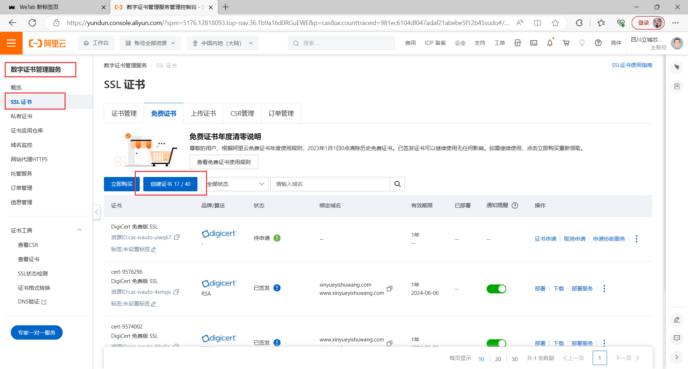
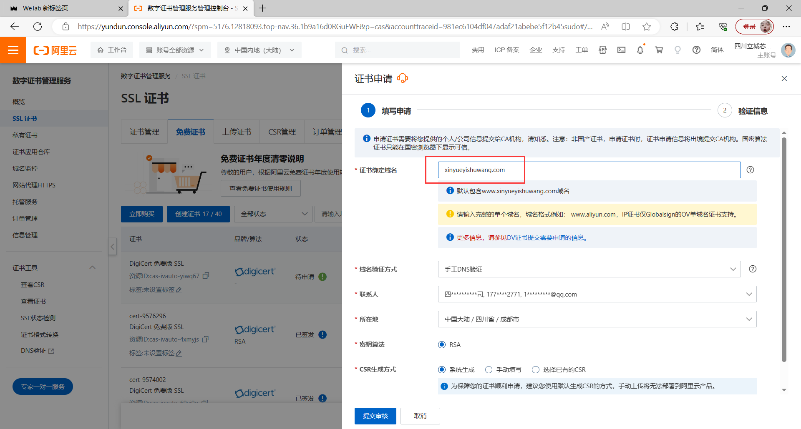
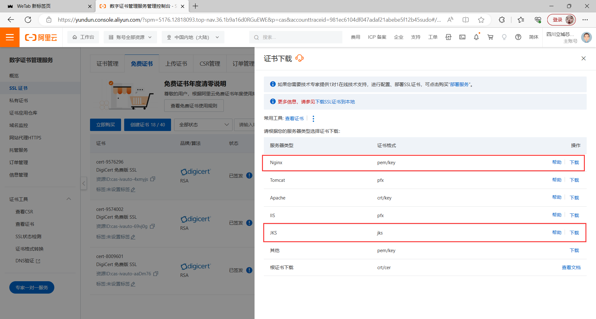
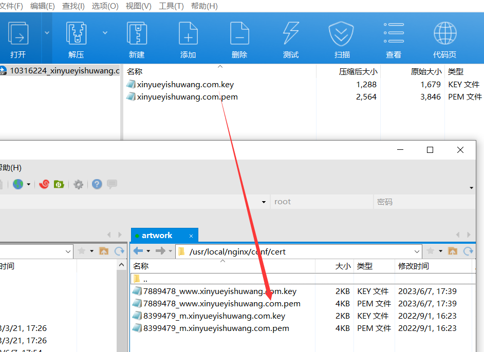
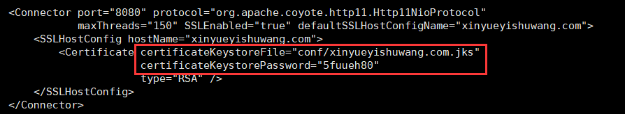
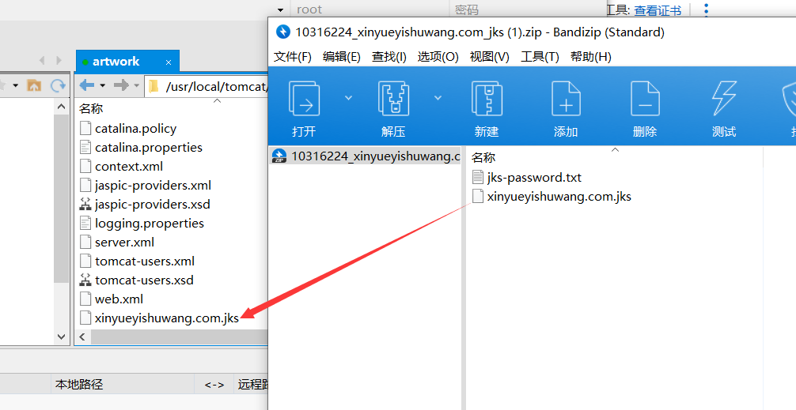

---
typora-copy-images-to:./
---

# 服务器运维


## SSL证书过期更新流程


### 1 阿里云申请证书

- 首先在阿里云中**数字证书管理服务**的**SSL证书**创建新的证书



- 点击**申请证书**，选择默认的即可，若需求不同可自行选择
- 填入绑定证书的域名



- 等待大约5分钟审核


### 2 下载对应的证书

- 这里下载**Nginx**和**JKS**(tomcat使用)服务类型的




### 3 替换Nginx下的证书

- 先查看**nginx.conf**中证书位置

  - 这里的**nginx.conf**位置在`/usr/local/nginx/conf`下

  ```shell
  cd /usr/local/nginx/conf
  
  # 查看当前目录下文件
  ls 
  
  # 查看文件内容
  cat nginx.conf
  ```

  - 定位证书位置在当前目录下`cert`文件下

  

  - 将下载的Nginx类型的证书替换过期的证书

    **注意：这里的名字一定要和nginx.conf文件里的文件一直，否者会找不到改文件**

  

  - 重启Nginx

  ```shell
  cd /usr/local/nginx/sbin
  
  # 启动测试
  ./nginx -t
  
  # 重启nginx
  ./nginx -s reload
  ```


### 4 替换Tomcat下的证书

- 先查看**server.xml**中证书位置

  - 这里的**server.xm**位置在`/usr/local/tomcat/apache-tomcat-8.5.78/conf`下

  ```shell
  cd /usr/local/tomcat/apache-tomcat-8.5.78/conf
  
  # 查看当前目录下文件
  ls 
  
  # 查看文件内容
  cat server.xml
  ```

  - 定位文件位置在`conf`文件下

  

  - 将下载的JKS类型的证书替换过期的证书

    **还是注意名称一致问题**

    

  - 同时将密码替换，打开压缩包中的密码，修改`server.xml`中的`certificateKeystorePassword`字段的值

  ```xml
      <Connector port="8080" protocol="org.apache.coyote.http11.Http11NioProtocol"
                 maxThreads="150" SSLEnabled="true" defaultSSLHostConfigName="xinyueyishuwang.com">
          <SSLHostConfig hostName="xinyueyishuwang.com">
          	# 替换相应的文件和修改对应的密码
              <Certificate certificateKeystoreFile="conf/xinyueyishuwang.com.jks"
                           certificateKeystorePassword="5fuueh80"
                           type="RSA" />
          </SSLHostConfig>
      </Connector>
  
  ```

  

  - 重启Tomcat

  ```shell
  cd /usr/local/tomcat/apache-tomcat-8.5.78/bin
  ./shutdown.sh
  ./startup.sh
  ```

